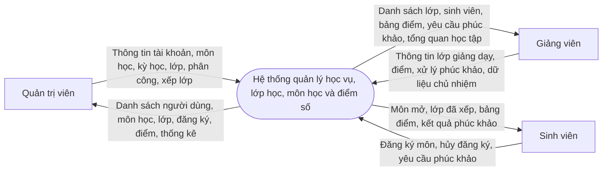
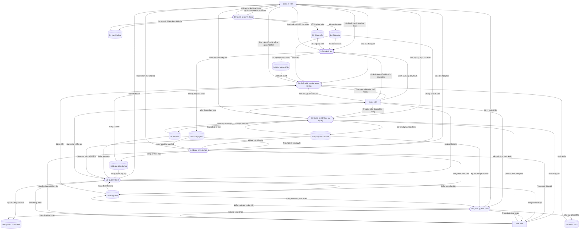
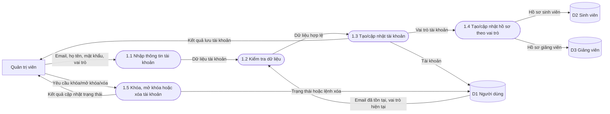
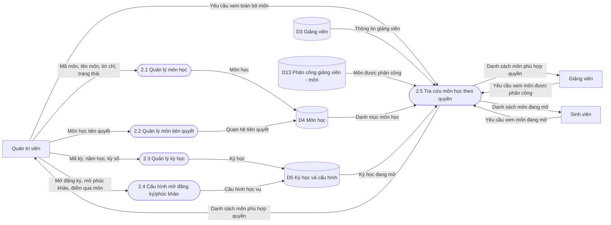
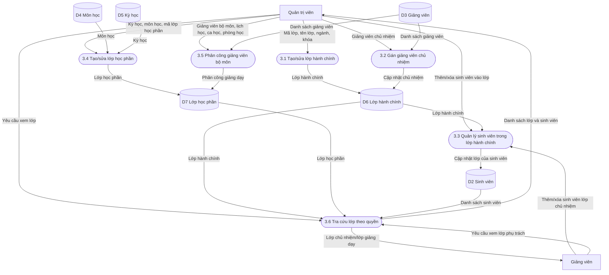
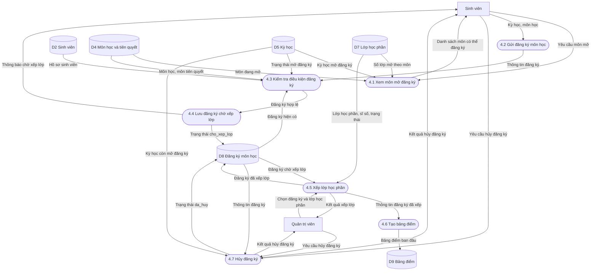
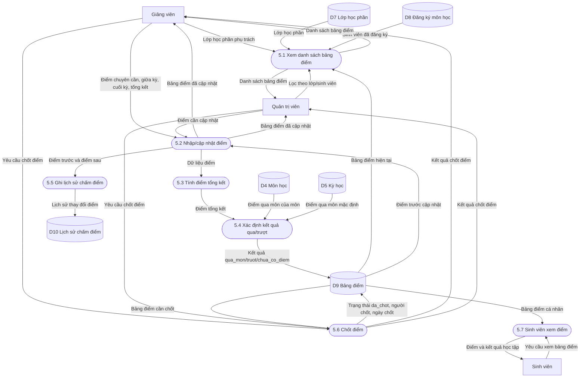
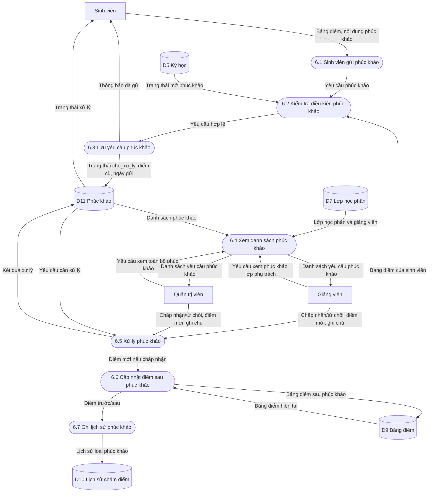
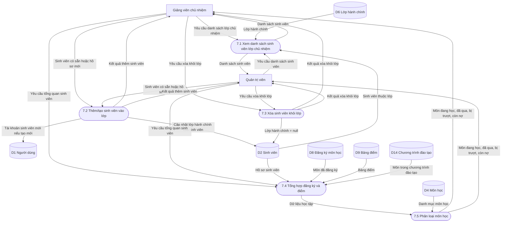

# SƠ ĐỒ DFD DỰ ÁN

Tài liệu này mô tả sơ đồ luồng dữ liệu của hệ thống quản lý học vụ, lớp học, môn học, điểm số và đánh giá kết quả học tập.

Ký hiệu sử dụng trong sơ đồ:

- Ô vuông: tác nhân bên ngoài hệ thống.
- Ô bo tròn: tiến trình xử lý.
- Hình trụ: kho dữ liệu.
- Mũi tên: luồng dữ liệu.

## 1. DFD mức ngữ cảnh

Sơ đồ mức ngữ cảnh thể hiện hệ thống như một tiến trình tổng quát và mô tả luồng dữ liệu giữa hệ thống với ba nhóm người dùng chính.

## 2. DFD mức 0

Sơ đồ mức 0 phân rã hệ thống thành các tiến trình nghiệp vụ chính và các kho dữ liệu trung tâm.

## 3. DFD mức 1 - Quản lý người dùng

## 4. DFD mức 1 - Quản lý môn học và kỳ học

## 5. DFD mức 1 - Quản lý lớp

## 6. DFD mức 1 - Đăng ký môn học và xếp lớp

## 7. DFD mức 1 - Quản lý điểm

## 8. DFD mức 1 - Phúc khảo điểm

## 9. DFD mức 1 - Chủ nhiệm và tổng quan học tập

## 10. Ma trận tiến trình và kho dữ liệu

| Tiến trình | Kho dữ liệu đọc | Kho dữ liệu ghi |
| --- | --- | --- |
| 1.0 Quản lý người dùng | Người dùng | Người dùng, Sinh viên, Giảng viên |
| 2.0 Quản lý môn học và học kỳ | Môn học, Kỳ học, Phân công giảng viên - môn | Môn học, Kỳ học và cấu hình |
| 3.0 Quản lý lớp | Sinh viên, Giảng viên, Môn học, Kỳ học | Lớp hành chính, Lớp học phần, Sinh viên |
| 4.0 Đăng ký môn học | Sinh viên, Môn học, Kỳ học, Lớp học phần, Đăng ký môn học | Đăng ký môn học, Bảng điểm |
| 5.0 Quản lý điểm | Đăng ký môn học, Bảng điểm, Môn học, Kỳ học | Bảng điểm, Lịch sử chấm điểm |
| 6.0 Quản lý phúc khảo | Kỳ học, Lớp học phần, Bảng điểm, Phúc khảo | Phúc khảo, Bảng điểm, Lịch sử chấm điểm |
| 7.0 Thống kê và tổng quan học tập | Sinh viên, Lớp hành chính, Đăng ký môn học, Bảng điểm, Phúc khảo | Không phát sinh dữ liệu chính |

## 11. Ghi chú triển khai vào báo cáo

Khi đưa vào báo cáo đồ án, có thể trình bày theo thứ tự:

1. DFD mức ngữ cảnh để giới thiệu hệ thống và tác nhân.
2. DFD mức 0 để trình bày toàn bộ phân rã chức năng.
3. DFD mức 1 cho các phân hệ quan trọng: người dùng, môn học, lớp, đăng ký môn, điểm và phúc khảo.
4. Ma trận tiến trình - kho dữ liệu để giải thích các bảng dữ liệu chính.
